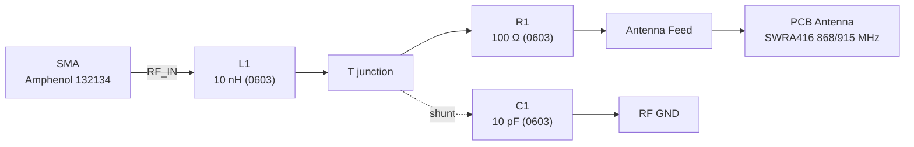

# Description

EX0001 is a simple RF matching network connecting a vertical SMA connector to a PCB antenna footprint. The network implements a series inductor (L1), shunt capacitor to ground (C1), and a series resistor (R1) to shape impedance (CRC topology) for operation in the 868–915 MHz ISM band.

The design composes the following modules from the Zener description (`boards/EX0001/EX0001.zen`):

- **SMA Connector**: Vertical SMA (Amphenol 132134), input reference
- **Matching Network**: L1 (series), C1 (shunt to GND), R1 (series)
- **PCB Antenna**: Meandered antenna footprint (Texas SWRA416 868/915 MHz)

**Board acceptance test criteria:**

- [ ] Continuity from SMA center → L1 → T-junction → R1 → antenna feed
- [ ] C1 shunts from T-junction to RF ground; SMA shell to ground net
- [ ] Footprints match library references; pins map to nets as defined
- [ ] DRC passes for clearances, antenna keepout, and via stitching
- [ ] Optional: S11 < -10 dB around target frequency after tuning

# Block diagram

## RF path and interfaces

## Nets

- **input**: SMA center pin to L1
- **t_junction**: Node between L1, C1, and R1
- **output**: Antenna feed after R1
- **gnd**: RF ground (SMA shell and shunt reference)

## Interface specifications

- **RF_IN (SMA center)**: 50 Ω source expected
- **RF_OUT (antenna feed)**: To PCB antenna footprint, observe keepout
- **GND (RF return)**: Low-impedance ground with via stitching near SMA and antenna

## Component details

### SMA Connector (SMA_Connector)

- Footprint: `@kicad-footprints/Connector_Coaxial.pretty/SMA_Amphenol_132134_Vertical.kicad_mod`
- Symbol: `@kicad-symbols/Connector.kicad_sym:Conn_Coaxial_Small`

### Antenna (Antenna)

- Footprint: `@kicad-footprints/RF_Antenna.pretty/Texas_SWRA416_868MHz_915MHz.kicad_mod`
- Symbol: `@kicad-symbols/Device.kicad_sym:Antenna`

### Passives

- L1: 10 nH, 0603 (series, `input` → `t_junction`)
- C1: 10 pF, 0603 (shunt, `t_junction` → `gnd`)
- R1: 100 Ω, 0603 (series, `t_junction` → `output`)

## Design considerations

- Maintain 50 Ω transmission line from SMA to matching network and to antenna feed (stackup-dependent)
- Provide ground via stitching near SMA, along the feed, and around C1 return
- Observe antenna footprint keepout and reference plane requirements (per SWRA416)
- Short, direct shunt path for C1 to ground; minimize loop area
- Tune R/L/C empirically or via EM/circuit simulation for the target band

## Generated artifacts

- Zener layout hint: `Layout(name = "Antenna CRC Matcher", path = "build/preview")`
- Use the `pcb` compiler to generate KiCad outputs from `EX0001.zen`